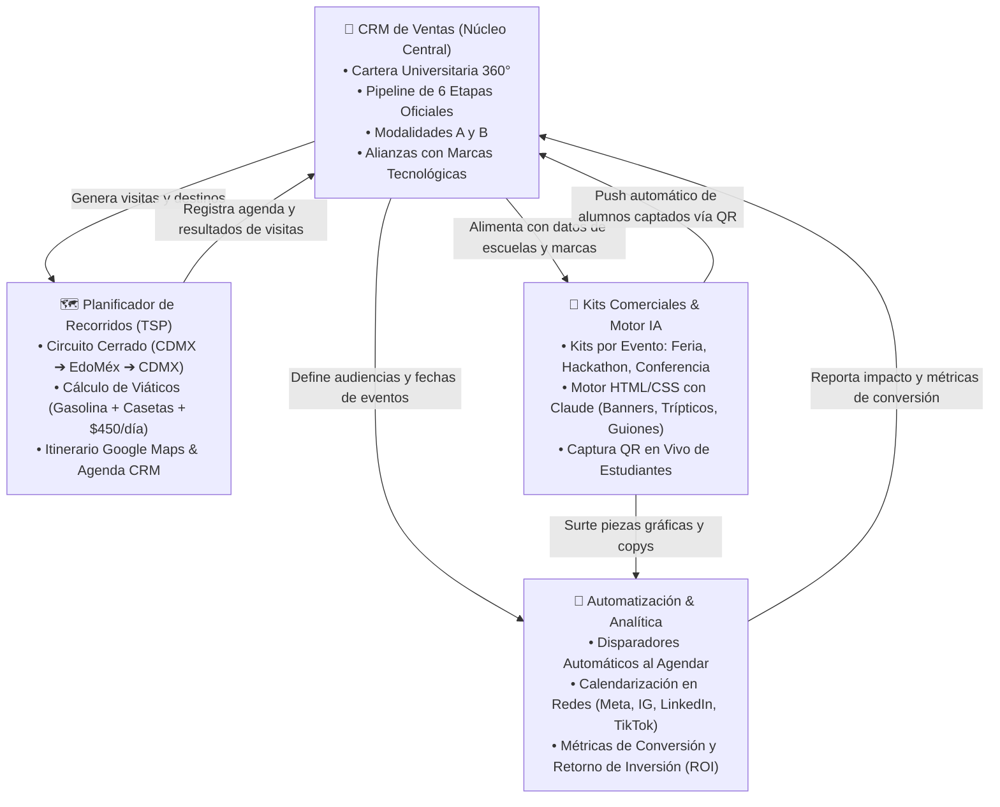
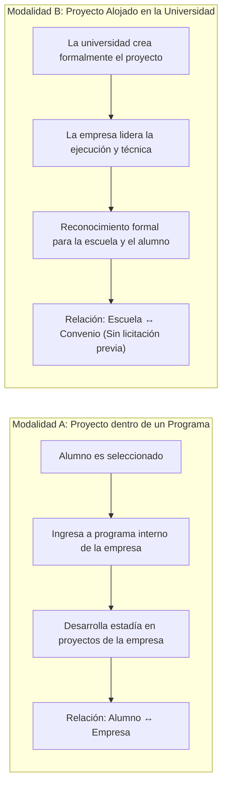
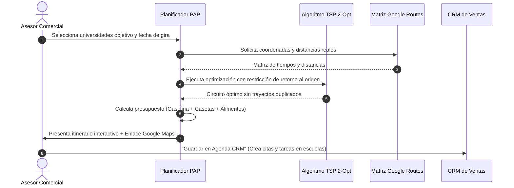
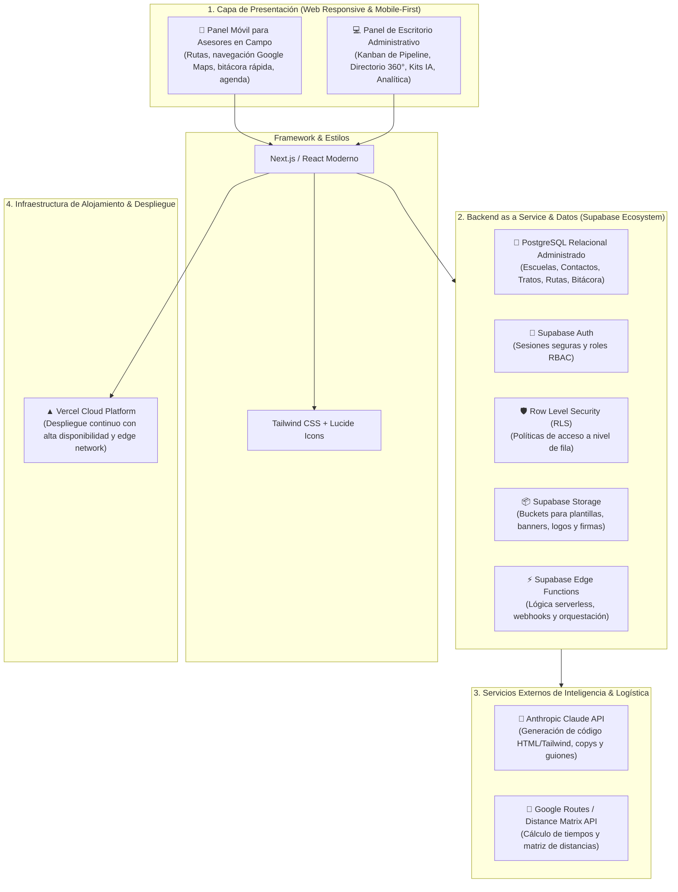
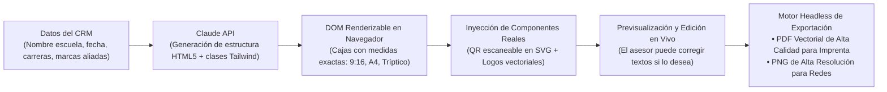
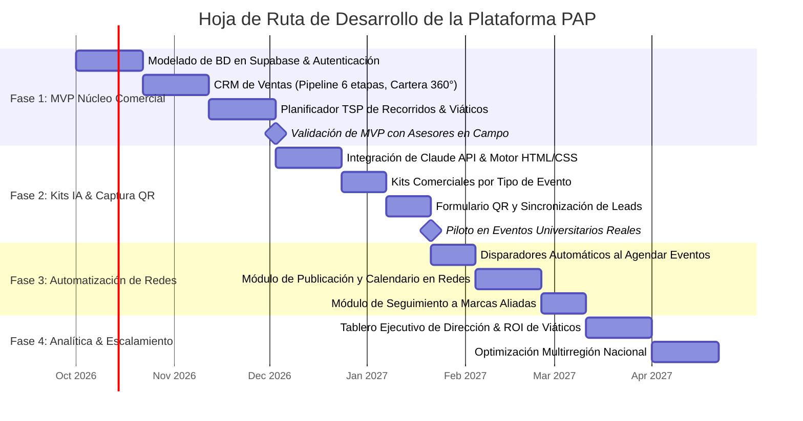

# Propuesta de Proyecto: Plataforma Automatizada de Publicidad (PAP)
## Sistema Integral de Gestión Comercial, Logística en Campo, Generación de Contenidos IA y Vinculación Universitaria

> **Documento Técnico y de Negocio · Versión 2.0 Definitiva**  
> **Área:** Tecnología / Desarrollo / Expansión Comercial  
> **Fecha de Emisión:** Septiembre 2026  
> **Clasificación:** Documento Interno de Especificación y Propuesta

---

## 1. Resumen Ejecutivo & Contexto Estratégico

### 1.1 El Momento del Negocio
La empresa se encuentra en una fase clave de expansión a nivel nacional. El crecimiento de los programas internos de capacitación técnica, formación profesional, residencias, estadías y modalidad dual requiere establecer y consolidar presencia en la mayor cantidad de instituciones de educación superior del país.

Esta presencia se materializa a través de actividades presenciales y digitales: **recorridos comerciales en campus, participación en ferias de empleo, organización de hackathons tecnológicos, impartición de conferencias magistrales y el desarrollo de proyectos de vinculación**. Todo ello respaldado estratégicamente por **alianzas con marcas líderes del sector tecnológico** (como AWS, Microsoft, Google Cloud y Cisco), las cuales aportan validación industrial, certificaciones y patrocinio de retos.

### 1.2 La Problemática Actual
Actualmente, la operación comercial y de difusión enfrenta cuatro fricciones operativas:
1. **Dispersión comercial:** El seguimiento a universidades, facultades y directores de carrera se realiza de forma fragmentada, sin un embudo unificado ni trazabilidad de acuerdos.
2. **Lentitud en la generación de materiales:** Cada visita o evento demanda folletos, carteles, banners y copys redactados desde cero, generando cuellos de botella en el área de diseño y marketing.
3. **Ineficiencia logística y sobrecostos:** Las visitas a escuelas en regiones como el Estado de México suelen programarse sin optimización geográfica, provocando trayectos redundantes y gastos excesivos en gasolina y casetas.
4. **Pérdida de prospectos en eventos:** En ferias y conferencias, los estudiantes interesados llenan listas manuales o no se registran, perdiéndose la trazabilidad directa hacia el sistema central.

### 1.3 La Solución: Plataforma Automatizada de Publicidad (PAP)
La **PAP** es un ecosistema digital concebido como una sola plataforma modular donde todos los componentes comparten los mismos datos. **El CRM de Ventas es el núcleo central**: alimenta a los demás módulos indicándoles a qué universidad se contacta, qué interlocutor atiende y qué tipo de evento se prepara; a su vez, los módulos le devuelven resultados medibles: visitas agendadas, viáticos autorizados, materiales generados y alumnos captados.

---

## 2. Modelo de Vinculación Universitaria y Marco Normativo en México

Uno de los factores diferenciales más críticos de la plataforma es su adaptación a la realidad jurídica y operativa del sistema universitario en México.

### 2.1 La Oportunidad ante la Ley de Adquisiciones
En el sector público tradicional, las dependencias gubernamentales están obligadas a licitar públicamente sus contrataciones de servicios. Sin embargo, las instituciones de educación superior autónomas y tecnológicas cuentan con esquemas normativos que **les permiten suscribir convenios de colaboración, vinculación académica y proyectos específicos sin requerir procesos de licitación pública federal**.

Para capitalizar esta ventaja, la plataforma contempla y distingue de forma nativa dos modalidades de proyecto:

* **Modalidad A (Proyecto dentro de un programa):**  
  El estudiante ingresa a uno de los programas de capacitación y talento de la empresa. La relación legal y operativa es directa entre el alumno y el programa. Se enfoca en volumen de captación y formación de talento.
* **Modalidad B (Proyecto alojado en la escuela):**  
  La universidad formula institucionalmente el proyecto o laboratorio tecnológico. Nuestra empresa proporciona el liderazgo técnico, la metodología y los especialistas, pero el beneficio curricular, la titularidad y el reconocimiento académico quedan formalmente en la institución educativa y sus estudiantes. **Esta modalidad acelera los tiempos de cierre institucional**, fortalece la presencia de marca y abre la puerta a convenios marco de largo plazo.

### 2.2 Sinergia con Marcas del Sector Tecnológico
La plataforma integra en cada oportunidad la participación de marcas tecnológicas aliadas (**AWS, Microsoft, Google Cloud, Cisco, entre otras**). Estas alianzas aportan tres valores clave:
1. **Para la universidad:** Acceso a tecnologías y certificaciones de vanguardia para sus egresados.
2. **Para la empresa:** Respaldo institucional de primer nivel que incrementa la tasa de conversión en las visitas comerciales.
3. **Para la marca aliada:** Presencia directa en la base estudiantil y captación de talento joven especializado en sus plataformas cloud.

---

## 3. Arquitectura Funcional: Los 4 Pilares del Sistema

Siguiendo la estructura del mapa funcional de módulos, el sistema se articula en cuatro pilares perfectamente integrados:

### 3.1 Pilar 1: CRM de Ventas Universitario (Núcleo Central)
Adaptado específicamente al ciclo de relacionamiento académico-institucional:
* **Cartera de Universidades (Cuentas 360°):** Ficha detallada por institución (campus, facultades técnicas, matrícula total, carreras prioritarias en sistemas/software, ubicación georreferenciada y *lead scoring* basado en afinidad tecnológica).
* **Directorio Jerárquico de Contactos:** Mapeo de autoridades educativas clasificadas por nivel de influencia en la toma de decisiones:
  * *Nivel Directivo:* Rectores, Vicerrectores y Directores Generales.
  * *Nivel Vinculación:* Directores de Vinculación, Servicio Social y Residencias Profesionales.
  * *Nivel Académico:* Jefes de Carrera, Coordinadores de Sistemas/Computación y Docentes líderes.
* **Pipeline Oficial de Oportunidades (6 Etapas):**
  $$\text{1. Prospecto} \longrightarrow \text{2. Contacto} \longrightarrow \text{3. Propuesta} \longrightarrow \text{4. Agendado 📅} \longrightarrow \text{5. Realizado 🚀} \longrightarrow \text{6. Resultado / Éxito 🏆}$$
  Cada etapa cuenta con criterios de salida estandarizados, cálculo automático de probabilidad ponderada de cierre y registro de la modalidad acordada (Modalidad A vs. Modalidad B).
* **Bitácora de Actividades y Minutas:** Registro cronológico de llamadas, reuniones virtuales, oficios enviados y compromisos pactados.

---

### 3.2 Pilar 2: Planificador Logístico de Recorridos & Control de Viáticos
Diseñado para resolver la operación cotidiana de los vendedores y asesores de vinculación en campo.

* **Optimización en Circuito Cerrado (TSP 2-Opt):** El asesor selecciona las universidades que requiere visitar en una región (por ejemplo, saliendo de Ciudad de México para recorrer municipios del Estado de México como Toluca, Naucalpan, Cuautitlán Izcalli, Ecatepec y Nezahualcóyotl). El algoritmo traza la ruta en anillo, garantizando que el asesor visite las escuelas en orden geográfico continuo y que las últimas visitas lo acerquen a su punto de origen sin dar vueltas innecesarias.
* **Presupuesto Auditable de Viáticos:**  
  Genera antes de la salida una tarjeta de liquidación preventiva:
  1. *Gasolina estimada:* Calculada con base en el kilometraje total de la ruta y un rendimiento estándar de $10.5\text{ km/L}$.
  2. *Casetas y peajes:* Estimación de autopistas de cuota y tramos periféricos.
  3. *Alimentos:* Asignación de viático fijo diario (\$450 MXN diarios por asesor en campo).
* **Navegación Móvil y Cierre en CRM:** Con un toque, el asesor abre la ruta preconfigurada en **Google Maps** desde su teléfono celular. Al concluir cada visita presencial, registra los acuerdos y minutas, los cuales quedan asociados al expediente de la universidad en el CRM.

---

### 3.3 Pilar 3: Kits Comerciales & Motor de Contenidos IA (Fusión Unificada)
El Kit Comercial no es un catálogo de productos a la venta; es el **paquete integral de insumos físicos y digitales que se llevan o publican para una actividad específica**. El Motor de IA es quien redacta y maquetará automáticamente dicho paquete según el tipo de evento:

| Tipo de Evento | Materiales Físicos y Logísticos | Contenidos Digitales y Redacción con IA | Captura de Alumnos |
| :--- | :--- | :--- | :--- |
| **Feria de Trabajo / Empleo** | • Estructura de stand modular (3×2 m) • 2 Roll-up banners con marcas aliadas • 500 Folletos trípticos institucionales | • Copys multicanal para redes (Instagram 9:16, TikTok, Meta) • Cartel informativo A4 para mamparas universitarias | **Formulario QR en Stand:** Los alumnos escanean el tríptico/banner y sus datos entran en tiempo real al CRM como prospectos del evento. |
| **Hackathon Tecnológico** | • 3 Retos técnicos formulados con marcas aliadas • Bolsa de premios oficial ($45,000 MXN en becas/tecnología) • 4 Mentores técnicos senior • Kit de bienvenida para 150 alumnos | • Convocatoria oficial y bases del concurso • Rúbricas de evaluación técnica • Guion del maestro de ceremonias | **Registro de Escuadras:** Inscripción digital de equipos con validación de credencial estudiantil y carreras afines. |
| **Conferencia / Taller Magistral** | • Presentación HD de diapositivas de alto impacto • Sala audiovisual / auditorio universitario • Reconocimientos de participación | • **Guion del Ponente (Speaker Script):** Estructurado con tiempos (Hook inicial, desarrollo TODO Academy, llamado a la acción) • Material descargable de seguimiento | **QR en Diapositiva Final:** El conferencista invita a escanear la pantalla para acceder a las plazas de estadías profesionales. |

---

### 3.4 Pilar 4: Automatización de Marketing & Analítica Ejecutiva
* **Disparadores por Cambio de Etapa:** En el momento exacto en que un asesor mueve una oportunidad a la fase *"Agendado"* en el CRM, el sistema detona la secuencia:
  * Genera el kit gráfico y los copys correspondientes.
  * Prepara el calendario de publicaciones en redes sociales segmentado por campus.
  * Sincroniza la fecha y horario en la agenda del equipo de vinculación.
* **Campañas Multicanal Adaptadas por Audiencia:**
  * *LinkedIn:* Dirigido a rectores y directores con tono B2B institucional.
  * *Instagram y TikTok:* Dirigido a la comunidad estudiantil con tono dinámico y tecnológico.
* **Tablero Ejecutivo de Analítica y Retorno de Inversión (ROI):**
  * Tasa de conversión de universidades por región.
  * Métricas de impacto: número total de alumnos captados en campo.
  * **Análisis de Eficiencia Económica:** Cruce entre el costo de viáticos invertido en la ruta vs. convenios concretados y alumnos captados por institución.

---

## 4. Stack Tecnológico Definitivo & Arquitectura Cloud

Superando la etapa preliminar del borrador referencial, la arquitectura tecnológica se define formalmente en tres niveles de producción:

### 4.1 Frontend: Enfoque 100% Mobile-First
El sistema se construye con **Next.js / React y Tailwind CSS**.  
* **Prioridad Mobile-First:** El asesor comercial pasa la mayor parte del tiempo en carretera o dentro de facultades universitarias, operando desde su teléfono móvil o tableta con conexiones de red variables. La interfaz móvil debe ser ultraligera, táctil, con acceso inmediato a su ruta del día, el teléfono de los contactos y el registro ágil de minutas.
* **Layout de Escritorio:** Para el personal comercial en oficina y la dirección, la interfaz se expande aprovechando monitores grandes para mostrar el tablero Kanban de 6 columnas, tablas de datos masivas y gráficos analíticos.

### 4.2 Backend & Base de Datos: Ecosistema Supabase
En lugar de mantener un servidor dedicado que requiera mantenimiento constante de infraestructura, se implementa **Supabase**:
* **PostgreSQL Relacional:** Base de datos robusta para gestionar relaciones complejas entre universidades, múltiples campus, historial de tratos y contactos con integridad referencial.
* **Supabase Auth & Row Level Security (RLS):** Garantiza que cada asesor solo modifique los datos que le corresponden, mientras los directores comerciales acceden a la visión global de la cartera.
* **Supabase Storage:** Almacenamiento seguro en la nube para logotipos institucionales de universidades, marcas aliadas y piezas gráficas exportadas.
* **Supabase Edge Functions:** Funciones TypeScript ligeras y de rápida respuesta para procesar llamadas a la API de Claude y sincronizar eventos sin sobrecargar al cliente.

### 4.3 Infraestructura de Alojamiento: Vercel
El frontend se aloja en **Vercel**, aprovechando su red de distribución global (Edge Network), tiempos de carga menores a un segundo y flujo de integración continua que permite probar avances de manera segura antes de pasarlos a producción.

---

## 5. Arquitectura del Motor de Contenidos IA: El Enfoque HTML-First

### 5.1 La Limitación de los Modelos de Imagen Tradicionales
Los generadores de imágenes basados en difusión (como Midjourney o DALL-E) no son aptos para la publicidad universitaria institucional por tres razones técnicas:
1. **Incapacidad tipográfica:** Frecuentemente producen textos con deformaciones, faltas de ortografía o letras inventadas.
2. **Imposibilidad de integrar códigos QR:** No pueden dibujar un código QR funcional y escaneable.
3. **Inflexibilidad:** Si un rector solicita corregir la fecha del evento o añadir el logotipo de una nueva facultad, una IA de imagen tiene que redibujar toda la imagen desde cero, perdiendo el diseño previo y consumiendo tiempo y dinero.

### 5.2 La Solución: Plantillas Semánticas en HTML5/CSS con Claude
Claude posee una capacidad sobresaliente para estructurar código web semántico, limpio y visualmente atractivo. Por ello, la PAP adopta el flujo **HTML-First**:

#### Ventajas Competitivas del Enfoque:
* **Edición inmediata:** El asesor o mercadólogo puede ver el tríptico en pantalla y cambiar un párrafo o una fecha en un segundo antes de autorizarlo.
* **Resolución vectorial infinita:** Al ser HTML renderizado a PDF mediante un navegador headless (como Puppeteer o Chromium), el texto y los logotipos nunca se pixelan al mandarse a imprenta.
* **Códigos QR 100% operativos:** El QR no es un dibujo; es un componente vectorial generado matemáticamente con el enlace de postulación de esa institución específica.
* **Velocidad y bajo costo:** Generar un documento HTML con Claude toma escasos segundos y consume una fracción ínfima del costo de un modelo de imagen.

---

## 6. Seguridad, Roles y Protección de Datos Personales (LFPDPPP)

### 6.1 Matriz de Control de Acceso por Roles (RBAC)
La plataforma segmenta los permisos en 5 perfiles para asegurar el orden operativo:

| Rol | Alcance en la Plataforma |
| :--- | :--- |
| **Vendedor / Asesor en Campo** | Acceso Mobile-First a su cartera asignada, itinerario de rutas del día, navegación GPS y registro de minutas y resultados de visitas. |
| **Marketing / Contenidos** | Generación de piezas con IA, supervisión de plantillas de kit, personalización de copys y calendarización de redes sociales. |
| **Comercial / Coordinación** | Aprobación de acuerdos y convenios, configuración de alianzas con marcas tecnológicas y supervisión del pipeline de ventas. |
| **Dirección General** | Visualización de tableros ejecutivos, cumplimiento de metas de captación, avance de expansión nacional y análisis de ROI de viáticos. |
| **Administrador** | Gestión de usuarios, perfiles, asignación de permisos y mantenimiento de catálogos del sistema. |

### 6.2 Cumplimiento Normativo (LFPDPPP México)
El levantamiento de prospectos estudiantiles a través de los códigos QR en ferias y conferencias cumple rigurosamente con la **Ley Federal de Protección de Datos Personales en Posesión de los Particulares**:
* **Aviso de Privacidad Simplificado:** Visible de forma obligatoria en la pantalla de registro QR antes de enviar el formulario.
* **Consentimiento Expreso:** Casilla de verificación para autorizar el contacto con fines educativos y de capacitación profesional.
* **Seguridad de la Información:** Cifrado de datos en tránsito mediante protocolos HTTPS/TLS 1.3 y cifrado en reposo en la base de datos de Supabase.

---

## 7. Hoja de Ruta y Segmentación del Desarrollo por Fases

Para garantizar una ejecución eficiente, libre de riesgos y con entregables de valor tangibles desde las primeras semanas, el desarrollo se segmenta en **4 Fases Incrementales**:

### Detalle de Entregables por Fase:

#### Fase 1 · MVP Operativo (Núcleo Comercial y Rutas)
* **Objetivo:** Poner en manos de los asesores comerciales una herramienta móvil funcional que ordene la cartera escolar y elimine el desperdicio de viáticos en carretera.
* **Entregables:**
  * Estructura de base de datos relacional y perfiles de usuario en Supabase.
  * Cartera de universidades con información de contactos, carreras y lead scoring.
  * Tablero Kanban de ventas con las 6 etapas oficiales y soporte para Modalidad A y B.
  * Planificador de recorridos en circuito cerrado con cálculo de gasolina, casetas y alimentos.
  * Enlace directo de navegación a Google Maps y agenda de reuniones sincronizada al CRM.

#### Fase 2 · Motor de Contenidos IA & Kits Inteligentes
* **Objetivo:** Automatizar la creación de todo el material gráfico y de comunicación necesario para eventos presenciales.
* **Entregables:**
  * Conexión con Claude API para la generación de copys, guiones de ponentes e invitaciones formales.
  * Maquetador de plantillas HTML/Tailwind para banners, carteles y folletos trípticos de 3 cuerpos.
  * Módulo de Kits comerciales configurado para Feria de Trabajo, Hackathon y Conferencia Magistral.
  * Formulario web interactivo vía código QR para captura en vivo de prospectos estudiantiles conectada al CRM.
  * Exportador a PDF de alta resolución para impresión en imprenta.

#### Fase 3 · Automatización de Marketing & Alianzas
* **Objetivo:** Amplificar el alcance de cada evento agendado mediante difusión digital programada.
* **Entregables:**
  * Flujo de secuencias automatizadas activadas al pasar un trato a la etapa "Agendado".
  * Calendario de redes sociales multicanal (Meta, Instagram, LinkedIn y TikTok) por región y campus.
  * Módulo de control de compromisos y métricas de exposición para marcas aliadas (AWS, Microsoft, Google Cloud).

#### Fase 4 · Analítica Ejecutiva & Escalamiento Nacional
* **Objetivo:** Proporcionar a la Dirección General visibilidad integral del retorno de inversión y preparar la plataforma para operar en múltiples estados del país.
* **Entregables:**
  * Tablero de control de Dirección con gráficos de conversión global y cumplimiento de metas.
  * Reporte de ROI: costo real de viáticos y traslados vs. número de convenios firmados y alumnos captados.
  * Soporte multirregional para extender las operaciones más allá de CDMX y EdoMéx (hacia Jalisco, Nuevo León, Puebla, Querétaro, entre otros).

---

## 8. Conclusiones y Próximos Pasos

La **Plataforma Automatizada de Publicidad (PAP)** no es únicamente una herramienta de software; es el motor operativo que permitirá a la empresa escalar de manera ordenada y rentable su vinculación con el sector universitario de México.

Al unir en un solo ecosistema el **orden comercial del CRM**, la **eficiencia logística del planificador de recorridos**, la **velocidad de producción de los kits con inteligencia artificial en HTML** y el **cierre del circuito mediante la captación digital de alumnos**, la plataforma transforma un proceso tradicionalmente disperso en una operación ágil, medible y de alto impacto institucional.

### Próximos Pasos Inmediatos:
1. **Presentación de la propuesta:** Validación de los alcances técnicos y funcionales de este documento con Dirección y el Área Comercial.
2. **Definición de prioridades de arranque:** Ratificación del alcance de la **Fase 1 (MVP)** para iniciar el sprint de arquitectura en Supabase y desarrollo de la interfaz mobile-first.
3. **Alineación de insumos comerciales:** Homologación final de los textos institucionales y formatos gráficos base que alimentarán el motor de plantillas de la Fase 2.
